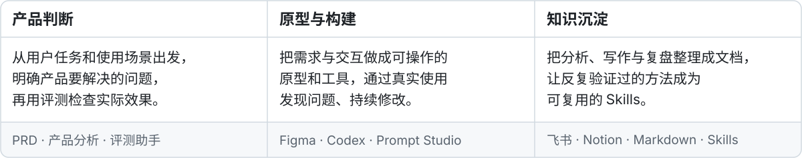

  

## 你好，我是圆号

**AI PM · AI Designer · AI Builder**

关注 AI 产品、交互设计与工具构建。我的作品从天气穿搭延伸到 Prompt 编辑、多模型对比，也把产品分析、写作和评测中的工作方法整理成可复用的 Skills。

 

  &nbsp;
  &nbsp;
  

  &nbsp;
  

 

<h3><big>我如何工作</big></h3>

 

  YUANHAO / 产品 · 设计 · 构建

