  

  <a href="#about">关于我</a> · <a href="#work">精选作品</a> · <a href="#skills">Skills</a> · <a href="https://github.com/yuanhao667?tab=repositories">全部项目 ↗</a>

 

## 你好，我是 Yuanhao

**AI PM · AI Designer · AI Builder**

关注 AI 产品、交互设计与工具构建。我的作品从天气穿搭延伸到 Prompt 编辑、多模型对比，也把产品分析、写作和评测中的工作方法整理成可复用的 Skills。

这里放着我的产品实践，以及一路积累下来的工具与方法。

 

## 精选作品

<table>
<tr>
<td width="50%" valign="top">

### 01 / Prompt Studio

**给 Prompt 一个认真工作的地方。**

原生 macOS Prompt 工作台。结构化编辑、AI 参考稿并排对照、版本回溯，让每一次修改都有迹可循。

macOS · Prompt 编辑 · 版本管理

[查看项目 ↗](https://github.com/yuanhao667/Prompt-Studio)

</td>
<td width="50%" valign="top">

### 02 / Model Battle

**同一个任务，看看不同模型怎么做。**

在 Mac 上并行调用多个模型，对照输出、耗时与 Token 用量。支持文本、图片、音频和视频任务。

Apple Silicon · 多模型对比 · 多模态

[查看项目 ↗](https://github.com/yuanhao667/model-battle)

</td>
</tr>
<tr>
<td width="50%" valign="top">

### 03 / WearCue

**每天少想一件事，穿什么。**

结合天气与出行场景的 AI 穿搭助手。保存自己的穿搭灵感，把今天的天气变成可以照着穿的建议。

AI 生活应用 · 天气穿搭 · 邀请制体验

[查看项目 ↗](https://github.com/yuanhao667/wearcue)

</td>
<td width="50%" valign="top">

### 04 / Codex Skills

**把反复做的工作，整理成可复用的方法。**

面向产品、写作、AI 评测与文档整理的 Skills。每个都有明确的适用场景，可以按需独立安装。

Agent Skills · 产品工作流 · 内容创作

[浏览 Skills ↗](https://github.com/yuanhao667/Skills)

</td>
</tr>
</table>

 

## 从项目里长出来的方法

| 方向 | 我整理的 Skills |
| :--- | :--- |
| **产品与需求** | [PRD](https://github.com/yuanhao667/Skills/tree/main/skills/prd) · [产品分析](https://github.com/yuanhao667/Skills/tree/main/skills/product-analysis) |
| **写作与表达** | [中文写作](https://github.com/yuanhao667/Skills/tree/main/skills/human-writing) · [Red Book](https://github.com/yuanhao667/Skills/tree/main/skills/red-book) · [README Plus](https://github.com/yuanhao667/Skills/tree/main/skills/readme-plus) |
| **评测与整理** | [评测助手](https://github.com/yuanhao667/Skills/tree/main/skills/evaluation-assistant) · [飞书文档增量融合](https://github.com/yuanhao667/Skills/tree/main/skills/feishu-doc-incremental-merge) |

 

---

  YUANHAO / 产品 · 设计 · 构建 
  欢迎在项目 Issues 里交流使用体验、问题与建议。

